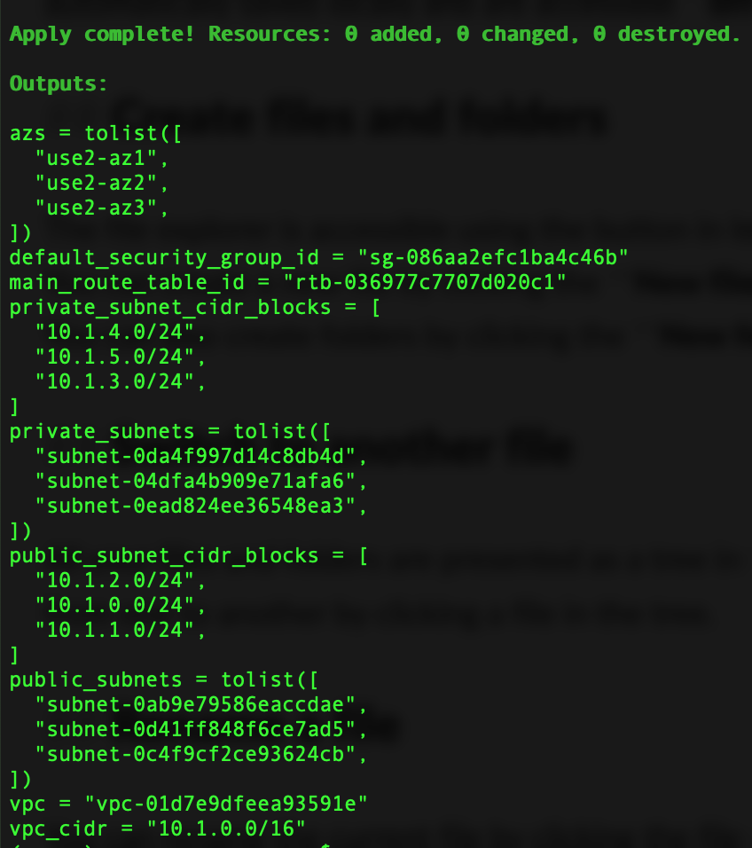
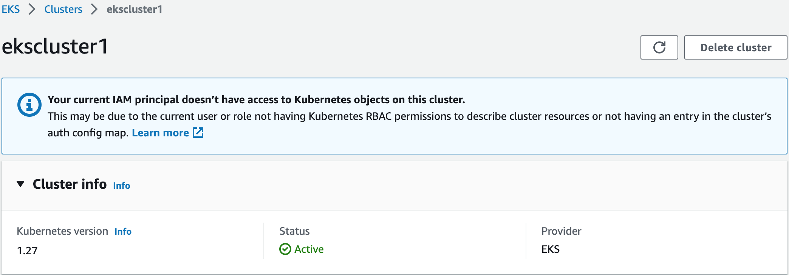
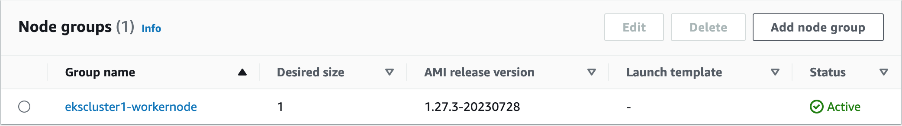
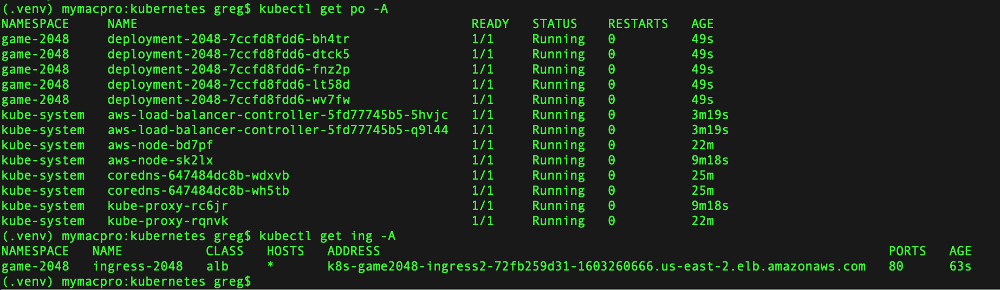
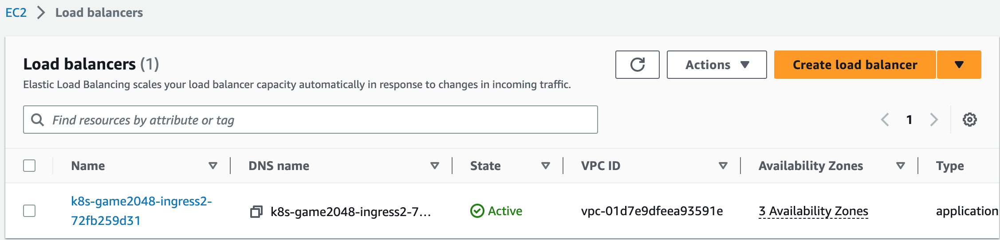
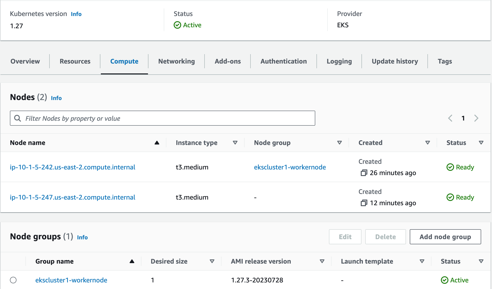
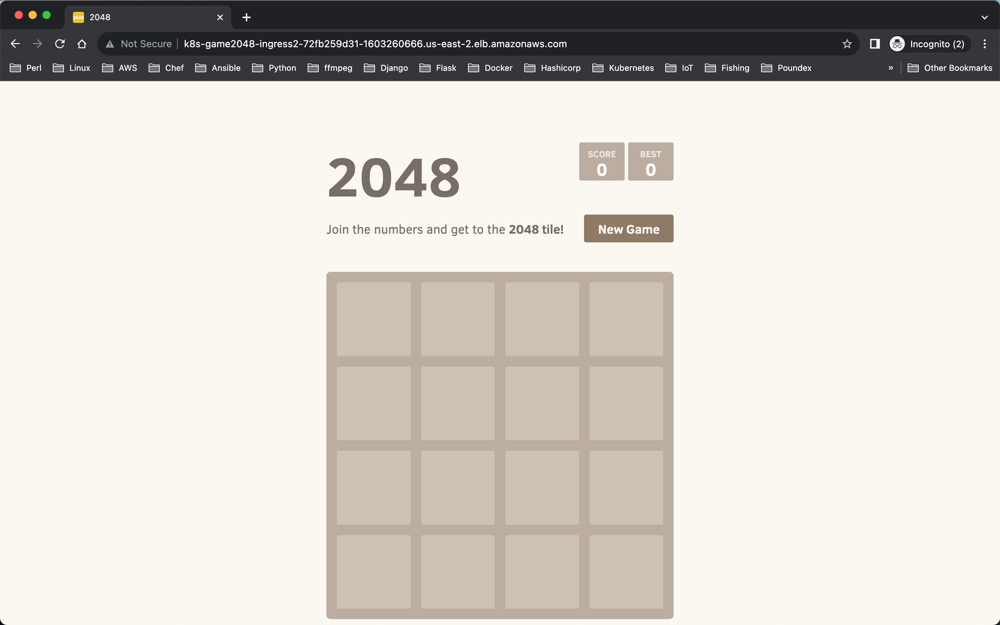
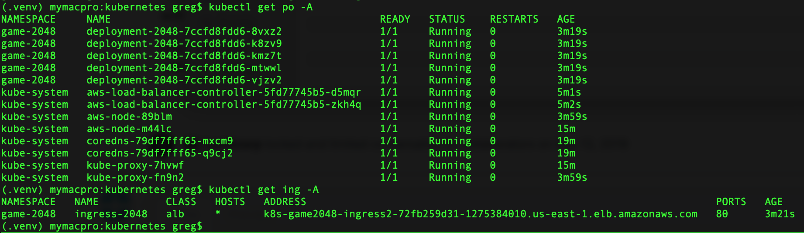

## VPC, EKS, Kubernetes and Helm in Terraform
#### This creates VPC, EKS, AWS Managed Nodes and Self-Managed Nodes and AWS ELB Load Balancer Add-on with AWS, Kubernetes and Helm providers. 
[AWS Load Balancer Add-on](https://docs.aws.amazon.com/eks/latest/userguide/aws-load-balancer-controller.html)
### How to run this Terraform?
#### In vpc directory
The file vpc.tf will create a vpc in the region you specify in provider.tf. This has been tested in Virginia and Ohio. It creates one public and private subnet in each az except us-east-1e in the region. It also creates a default sg, private sg and a nat gateway for the egress traffic for private subnets. 
````
cd vpc
terraform init
terraform plan
terrafom apply -auto-approve
````
You should see your results similar with this
````
Apply complete! Resources: 0 added, 0 changed, 0 destroyed.
Outputs:
azs = tolist([
  "use2-az1",
  "use2-az2",
  "use2-az3",
])
default_security_group_id = "sg-086aa2efc1ba4c46b"
main_route_table_id = "rtb-036977c7707d020c1"
private_subnet_cidr_blocks = [
  "10.1.4.0/24",
  "10.1.5.0/24",
  "10.1.3.0/24",
]
private_subnets = tolist([
  "subnet-0da4f997d14c8db4d",
  "subnet-04dfa4b909e71afa6",
  "subnet-0ead824ee36548ea3",
])
public_subnet_cidr_blocks = [
  "10.1.2.0/24",
  "10.1.0.0/24",
  "10.1.1.0/24",
]
public_subnets = tolist([
  "subnet-0ab9e79586eaccdae",
  "subnet-0d41ff848f6ce7ad5",
  "subnet-0c4f9cf2ce93624cb",
])
vpc = "vpc-01d7e9dfeea93591e"
vpc_cidr = "10.1.0.0/16"
````

#### In eks directory
This creates a eks cluster in the vpc you create in vpc directory. The node groups is created with aws managed. For practice purpose, it only creates one node. You can change the values in num_node in tf.auto.tfvars to increase nodes. 
````
cd eks
terraform init
terraform plan
terrafom apply -auto-approve
````
You should see your results similar with this
````
Apply complete! Resources: 8 added, 0 changed, 0 destroyed.
Outputs:
aws_ami = "ami-015095404333cb810"
aws_availability_zones_id = "us-east-2"
aws_availability_zones_name = tolist([
  "us-east-2a",
  "us-east-2b",
  "us-east-2c",
])
aws_availzones = tolist([
  "use2-az1",
  "use2-az2",
  "use2-az3",
])
eks_identity = {
  "oidc" = tolist([
    {
      "issuer" = "https://oidc.eks.us-east-2.amazonaws.com/id/62AB7E665CC9B6D64FA2C3D549C797A5"
    },
  ])
}
subnets = {
  "filter" = toset([
    {
      "name" = "tag:Name"
      "values" = tolist([
        "*private*",
      ])
    },
    {
      "name" = "vpc-id"
      "values" = tolist([
        "vpc-01d7e9dfeea93591e",
      ])
    },
  ])
  "id" = "us-east-2"
  "ids" = tolist([
    "subnet-0da4f997d14c8db4d",
    "subnet-04dfa4b909e71afa6",
    "subnet-0ead824ee36548ea3",
  ])
  "tags" = tomap(null) /* of string */
  "timeouts" = null /* object */
}
````



#### In kubernetes directory
This creates a launch template for autoscaling group, the group for self-managed worker node for eks.
The previous eks Terraform creates a aws managed worker node, then config map aws-auth is created. We import it in order to modify config map aws-auth for self-managed worker node.
````
terraform import kubernetes_config_map.aws-auth kube-system/aws-auth
cd kubernetes
terraform init
terraform plan
terraform apply -auto-approve
````
You should see your results similar with this
````
Apply complete! Resources: 1 added, 0 changed, 0 destroyed.                                                                                                                                                 
                                                                                                                                                                                                            
Outputs:                                                                                                                                                                                                    
                                                                                                                                                                                                            
aws_ami = "ami-015095404333cb810"                                                                                                                                                                           
aws_availability_zones_id = "us-east-2"                                                                                                                                                                     
aws_availability_zones_name = tolist([                                                                                                                                                                      
  "us-east-2a",                                                                                                                                                                                             
  "us-east-2b",                                                                                                                                                                                             
  "us-east-2c",                                                                                                                                                                                             
])                                                                                                                                                                                                          
aws_availzones = tolist([                                                                                                                                                                                   
  "use2-az1",                                                                                                                                                                                               
  "use2-az2",                                                                                                                                                                                               
  "use2-az3",                                                                                                                                                                                               
])                       
````
Let's test aws load balaner add-on
````
aws eks update-kubeconfig --region us-east-2 --name ekscluster1
kubectl apply -f 2048_full.yaml
````
ALB takes a couple of minutes to provision.
````
kubectl get ing -A
NAMESPACE NAME CLASS HOSTS ADDRESS PORTS AGE
game-2048 ingress-2048 alb * k8s-game2048-ingress2-72fb259d31-1603260666.us-east-2.elb.amazonaws.com 80  31m
````
us-east-2




us-east-1



#### To delete all created resources
````
In terraform/aws
cd kubernetes
kubectl delete -f 2048_full.yaml
terraform destroy -auto-approve
cd ../eks
terraform destroy -auto-approve
cd ../vpc
terraform destroy -auto-approve
````
